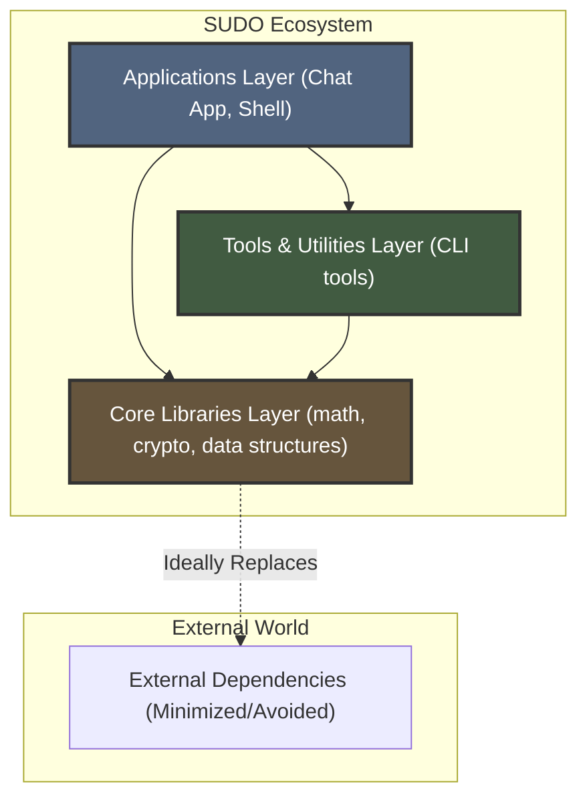

# SUDO - Society of Unified Developers and Operators

> Fostering Foundational Systems Programming and Collaborative Software Development within the NITJ Community and Beyond.

## About SUDO

**SUDO (Society of Unified Developers and Operators)** is an independent collective dedicated to the pursuit of deep understanding and practical skill in computer science through the collaborative construction of systems software. We operate on the principle of building robust, performant software **from the ground up**, adhering to POSIX standards where applicable.

Our focus is not merely on using existing tools, but on understanding and creating the foundational components that underpin modern software.

## Core Philosophy: The Layered, Zero-Dependency Model

At the heart of SUDO lies a commitment to a **layered, zero-dependency development model**. We strive to minimize or eliminate reliance on external pre-compiled libraries for core functionality within our ecosystem.

**How it Works:**

1.  **Identify Need:** When a higher-level project (e.g., an Application) requires specific functionality (e.g., advanced math operations, data serialization, encryption), we first look for this functionality within our existing *internal* SUDO libraries.
2.  **Develop Internally:** If the required functionality does not exist or is insufficient in our internal libraries (e.g., our own rudimentary `numpy`-like library, `sudocrypt`), we **prioritize developing or enhancing that internal library** rather than immediately importing an external dependency.
3.  **Build Layers:** This creates a dependency graph where higher-level SUDO projects explicitly depend on lower-level SUDO libraries and tools. Applications build upon Tools, which in turn build upon Core Libraries.
4.  **Iterative Maturation:** As higher-level projects demand more features from the lower layers, those foundational libraries become more mature, feature-rich, and battle-tested through internal use ("dogfooding").

**Visual Representation:**

Diagram: Higher layers utilize components built in the lower layers within the SUDO ecosystem, minimizing external dependencies.

## Why This Approach?

This methodology provides significant benefits, particularly in an academic and skill-building context:

- **Deep Foundational Knowledge:** Participants gain unparalleled insight into how fundamental software components are designed, implemented, and interact.

- **Practical C/Systems Mastery:** Develop strong, practical skills in C programming, memory management, build systems, and OS-level concepts.

- **API Design & Interoperability:** Learn to design, implement, and document clear APIs for internal libraries and potentially explore Foreign Function Interfaces (FFI) for cross-language use later.

- **Sustainable Skill Development:** Creates a virtuous cycle where improving foundational tools directly enables more ambitious projects.

- **True Open Source Ethos:** Fosters a culture of not just using open source, but actively building foundational components and sharing the knowledge gained.

## Project Structure

Our repositories are typically organized into these categories:

- **Core Libraries (sudo-lib-*):** Foundational, reusable C libraries providing core data structures, algorithms, or functionalities (e.g., math, crypto primitives, collections). Designed for maximum reusability and minimal dependencies (ideally none outside the C standard library and POSIX).

- **Tools & Utilities (sudo-tool-*):** Standalone command-line tools or smaller applications, often utilizing Core Libraries (e.g., file encryption utility, system information tool).

- **Applications (sudo-app-*):** Larger, more complex projects that integrate multiple Core Libraries and Tools to deliver significant functionality (e.g., a custom network service, a rudimentary version control system).

- **Meta & Documentation (sudo-meta-*, sudo-docs):** Repositories for organization-wide documentation, contribution guidelines, blogs, and infrastructure.

## Contribution Model: Engaging at Every Level

We welcome contributions from individuals at all stages of their computer science journey. Our layered structure provides multiple entry points:

### Foundational Layers
The Core Libraries and basic Tools offer excellent starting points for newcomers. Contributions can include:

- Implementing well-defined functions (e.g., a new math function, a specific cryptographic helper)
- Writing unit tests for existing functionality
- Improving documentation (API references, usage examples)
- Refactoring code for clarity or performance
- Fixing identified bugs

### Higher Layers
As contributors gain familiarity with our codebase and philosophy, they can contribute to more complex Tools and Applications by:

- Integrating lower-layer libraries.
- Designing and implementing new features.
- Tackling architectural challenges.

## Documentation: A Core Mandate

Clear, comprehensive documentation is not an afterthought; it is integral to our development process. Each project is expected to maintain:

- **Project Documentation:** README.md files detailing the project's purpose, build instructions, usage, and API references (e.g., header file comments processed by Doxygen, dedicated markdown docs).

- **Blog & Knowledge Sharing:** We aim to maintain a blog or knowledge base (potentially via GitHub Wiki or a dedicated repository) where we document design decisions, development challenges, tutorials, and learnings from building our tools. This aids transparency and learning for both members and the wider community.

## Getting Involved

- **Explore Repositories:** Browse our projects to understand what we are building.

- **Review Documentation:** Read the README.md and any contribution guidelines (CONTRIBUTING.md) within specific repositories.

- **Identify Opportunities:** Look for "good first issues" labels, areas needing tests or documentation, or small features you'd like to add to foundational libraries.

- **Connect (Recommended):** Join our primary communication channel [Discord](https://discord.gg/vfpxX6WW) to discuss ideas, ask questions, and coordinate efforts.

- **Contribute:** Follow the standard GitHub flow (Fork -> Branch -> Code -> Pull Request).

We believe this structured, foundational approach provides a unique and highly valuable learning experience. We look forward to building remarkable things together, from the ground up.
